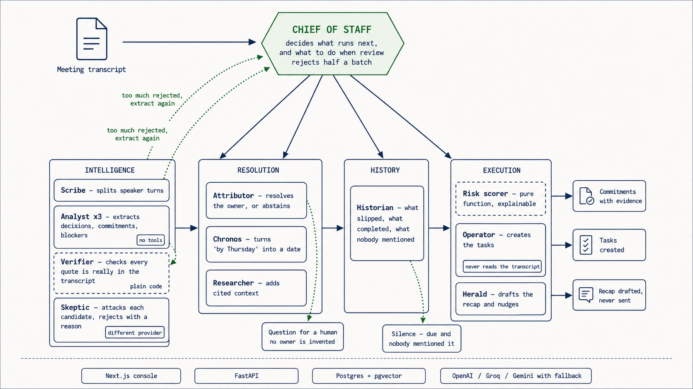
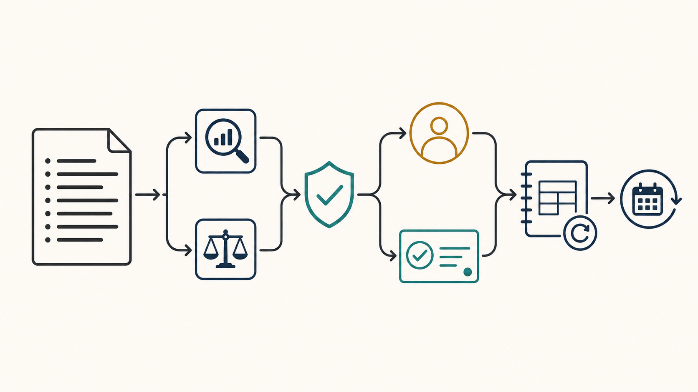

# Kept

> **Meetings make promises. Kept makes them accountable.**

Turn a meeting transcript into decisions, owned commitments, deadlines, tasks,
and a follow-up ledger that shows what slipped.

[Open the app](https://kept-meeting-agent.vercel.app) · [API docs](https://kept-api-3lq6.onrender.com/docs) · [Architecture](docs/ARCHITECTURE.md) · [Evaluation](docs/EVALUATION.md) · [Demo script](docs/DEMO_SCRIPT.md) · [AI usage](docs/AI_USAGE.md)

| Assignment requirement | Kept |
| --- | --- |
| Decisions, commitments, action items | Five-way extraction with a Skeptic review |
| Owners and deadlines | Roster + calendar resolution; asks when unsure |
| Task-management integration | Idempotent mock task API with retries |
| Follow-through | Risk, overdue items, clarifications, and cross-meeting slippage |
| Execution view | Live run trace, evidence, task board, and person ledger |

## Try it

1. Open the [live app](https://kept-meeting-agent.vercel.app).
2. Choose **Hard cases**. It includes suggestions, retracted dates, ambiguous ownership, and a real decision.
3. Run the team, then inspect the evidence and rejected candidates.
4. Run **Follow-up** next to see a moved deadline, a completed task, and an ignored promise.

The backend can take 30–60 seconds to wake after inactivity. That is Render's free tier, not a stalled run.

```
transcript → extract → challenge → verify → resolve → create tasks → track next meeting
              Analyst    Skeptic    code       roster
```

## Why it is not a summarizer

A summary can turn “we should look at it” into an action item and quietly
assign a task to the wrong person. Kept refuses that trade.

- Every stored commitment has a quote from the transcript. Code verifies it before persistence.
- The Analyst finds candidates; an independent Skeptic removes weak ones and says why.
- Unknown owner or date becomes a human question, not a made-up answer.
- The next meeting compares against open promises, so silence and slippage are visible.

## Architecture

An LLM supervisor handles the open-ended routing. Within each team, deterministic code handles exact work: quote verification, dates, roster lookup, and risk scoring. Models handle language only.



**Left to right:** transcript intake, independent extraction and review, grounding plus owner/date resolution, task creation, and the cross-meeting ledger. The lower route is the human clarification path. The loop checks the next meeting for progress or slippage.

Read the design choices and trade-offs in [docs/ARCHITECTURE.md](docs/ARCHITECTURE.md). The agent responsibilities are in [docs/AGENTS.md](docs/AGENTS.md).

<details>
<summary>How Kept keeps AI output reviewable</summary>



Two independent passes find and challenge candidates. A code gate verifies the evidence. Uncertain work waits for a human rather than becoming a guessed task.
</details>

## Evidence, not claims

The checked-in [evaluation](docs/EVALUATION.md) measures extraction, ownership,
grounding, correct abstention, an empty-meeting false-positive case, prompt
injection, and a single-prompt baseline. Latest run: **9/9 quotes verified**
and **0 false positives** on a transcript with no commitments.

Known limits: model-provider fallbacks can change a run and free tiers are slower. Email and nudges are drafted, never sent. Details and failure cases are in the evaluation.

## Run locally

Needs Python 3.12, Node 22, [uv](https://docs.astral.sh/uv/), pnpm, a Postgres database with pgvector, and at least one model-provider key.

```bash
cp .env.example backend/.env
# Set DATABASE_URL, DATABASE_URL_UNPOOLED, and GROQ_API_KEY.
make install
make migrate
make seed
make dev
```

App: `http://localhost:3000` · API: `http://localhost:8000/docs`

```bash
make check  # lint, types, and tests
make eval   # regenerate docs/EVALUATION.md
```

For direct deployed API calls, use the `X-Demo-Key` header with the demo key configured in the app.

## Repository

```text
backend/   FastAPI, LangGraph agents, persistence, task client
frontend/  Next.js execution console
evals/     labelled and adversarial transcripts
docs/      architecture, evaluation, demo script, AI usage note
```

## Deployment

| Part | Host |
| --- | --- |
| Frontend | Vercel |
| Backend | Render |
| Database | Neon Postgres + pgvector |
