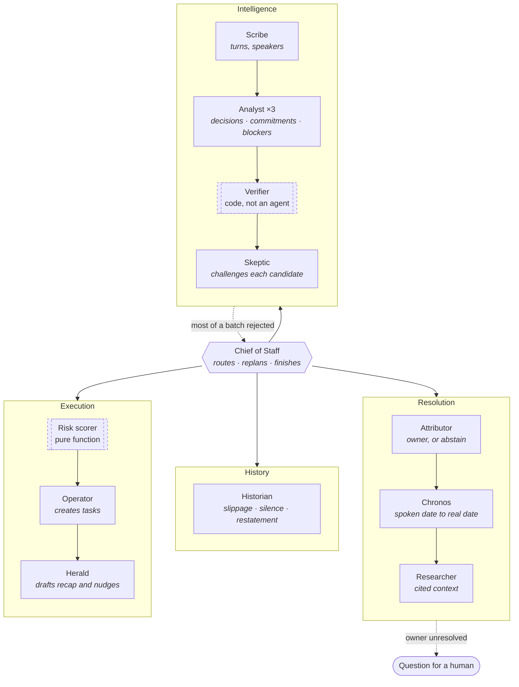

# Agents

The dashed boxes are plain code rather than agents, because they must never be
creative. The dotted arrows are the two places the system declines to proceed
on its own: re-extraction when review threw out too much, and a question when an
owner cannot be settled.

**The tool belt is the security boundary.** The Analyst reads the raw
transcript and has no tools. The Operator has every write tool and never reads
the transcript. An instruction hidden in a meeting has nothing to reach.
