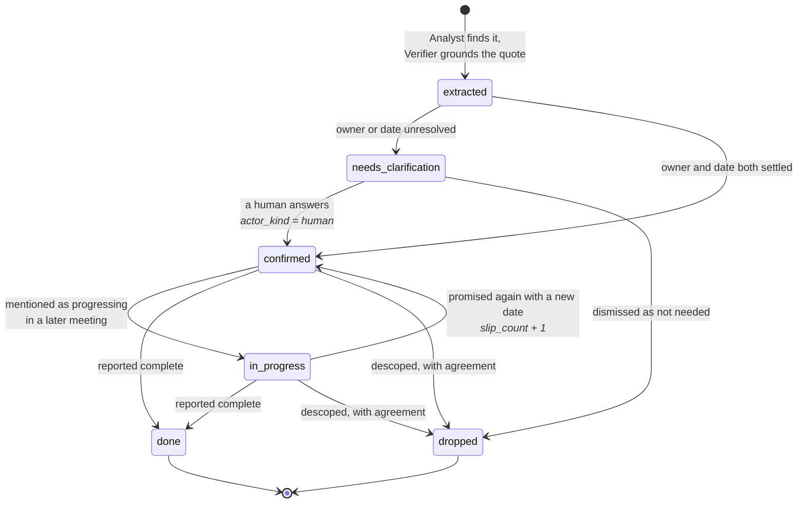
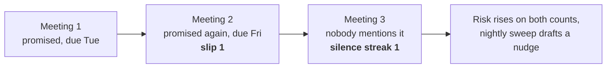

# Commitment lifecycle

**Overdue, at risk and slipped are not states.** They are arithmetic over the
due date, the slip count and the silence streak, recomputed on every read. A
status written down would start going stale the moment a day passed. See
[ADR 4](../adr/0004-computed-not-stored.md).

Every transition appends to `commitment_events`, which is never updated and
never deleted, and carries whether a person or an agent caused it. That log is
what the timeline in the console renders.

Silence is the signal no summarizer produces: there is nothing in the
transcript to summarise, because the promise is precisely what nobody said.
