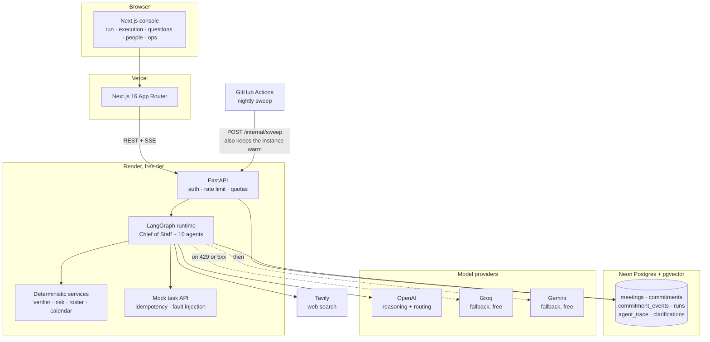

# System

The dotted edges are the fallback chain. Every tier is an ordered list of
provider and model pairs, filtered at boot to whatever has credentials, so the
system runs on free keys alone when that is all there is.
